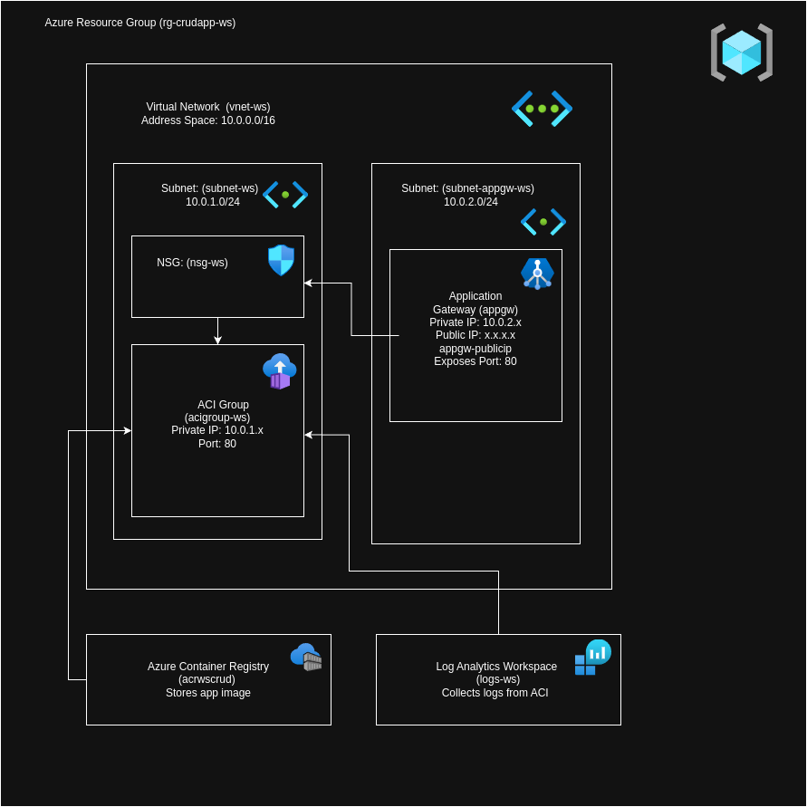

# Azure Application Gateway with Azure Container Instance

### 🟣 Routing Table

| Source               | Destination              | Protocol | Port | Action  | Notes                                    |
|----------------------|-------------------------|----------|------|---------|------------------------------------------|
| Internet             | Application Gateway     | HTTP     | 80   | Allow   | Public IP (appgw-publicip-ws) receives traffic |
| Application Gateway  | Azure Container Instance| HTTP     | 80   | Allow   | Forwards to ACI private IP via backend pool |
| ACI                  | Internet (Outbound)     | Any      | Any  | Allow   | Allowed by NSG outbound rule             |
| Internet             | ACI (Direct)            | -        | -    | Deny    | No Public IP exposed on ACI              |
| Subnet-ws            | Application Gateway     | -        | -    | Allow   | Internal Azure routing                  |

